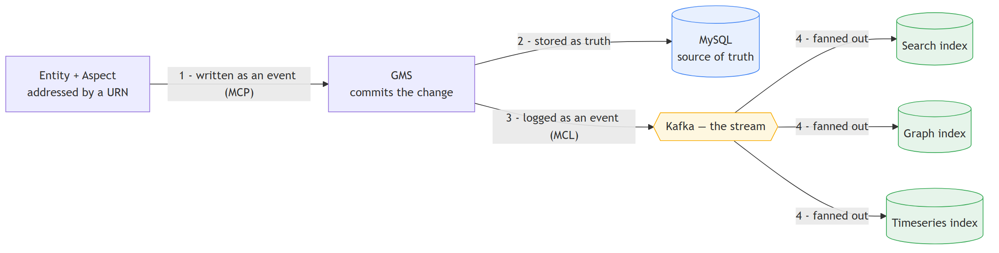

# Adopting DataHub — A Two-Page Primer for Application Owners

---

## Page 1 — What is DataHub?

> **DataHub is a graph database with a stream at its heart. Every piece of metadata is an (Entity, Aspect) pair, addressed by a URN, written as an event, logged, and fanned out into three read-optimized stores.**

<!-- Diagram source: diagrams/page1_model.mmd — regenerate with:
     npx -y @mermaid-js/mermaid-cli -i diagrams/page1_model.mmd -o diagrams/page1_model.png -b white -s 3 -->>

### The sentence, clause by clause

- **"a graph database"** — DataHub stores metadata as **nodes** (datasets, columns, users, domains) and **edges** (lineage, ownership, containment). Relationships are first-class data, so questions like *"what breaks downstream if this table is late?"* are cheap graph **walks**, not expensive SQL joins.

- **"a stream at its heart"** — every committed change becomes an **event on Kafka**. The searchable, browsable views you see are **materialized from that event log**. The log is the backbone; the indexes are derivatives of it.

- **"every piece of metadata is an (Entity, Aspect) pair"** — an **Entity** is the *thing* (a dataset, a user). An **Aspect** is one typed *slice* of metadata about it (its schema, its owners, its lineage, a data-quality run). Metadata is sliced into small aspects rather than one giant record, so each can evolve independently.

- **"addressed by a URN"** — every entity has a **globally unique ID** (`urn:li:dataset:(...)`). The URN is the primary key of the whole graph — how everything is found and linked.

- **"written as an event"** — you don't UPDATE a row; you **propose a change** (a *MetadataChangeProposal*). Metadata flows *in* as events.

- **"logged"** — once GMS commits, it emits a **MetadataChangeLog** event on the stream. This is the change-data-capture backbone. (Re-sending an identical aspect produces **no** event — DataHub no-ops unchanged metadata.)

- **"fanned out into three read-optimized stores"** — consumers read the log and update three indexes, each tuned for a different question:

  | Store | Answers | Example |
  |---|---|---|
  | **Search** | "find me things" | searching `card_auth` |
  | **Graph** | "what's connected" | the Lineage tab |
  | **Timeseries** | "how did it change over time" | data-quality run history |

  Truth lives in **MySQL**; these three are rebuildable copies. (In a quickstart deployment all three are physically backed by one OpenSearch engine.)

---

## Page 2 — How Applications Talk to DataHub: the Auth Proxy Model

Applications never talk to DataHub directly. Each application runs a small **Auth Proxy** sidecar on its own host. The application speaks plain, un-authenticated HTTP to `127.0.0.1`; the proxy holds the DataHub session and forwards the request upstream.

<!-- Diagram source: diagrams/page2_proxy.mmd — regenerate with:
     npx -y @mermaid-js/mermaid-cli -i diagrams/page2_proxy.mmd -o diagrams/page2_proxy.png -b white -s 3 -->>

### Why the proxy is *the* option for SSO-session-based DataHub

When DataHub authenticates through corporate **SSO**, logging in is an **interactive, browser-based flow**: a redirect to the identity provider, a human entering credentials, often MFA. There is no static API token to hand to a batch job.

Application code — a nightly ETL, a scheduled load — **cannot perform an interactive browser login.** Something has to perform the SSO login *once* and **hold the resulting session cookie**. That is exactly the proxy's job:

- it logs in to DataHub a single time and stores the session (`PLAY_SESSION` + `actor` cookies),
- it refreshes the session before it expires and silently retries on a `401`,
- so the application stays **completely auth-naive** — it never sees a credential, a cookie, or a login flow.

Without the proxy, every application team would have to re-implement fragile session-handling against an interactive SSO flow. The proxy solves it once, correctly, for everyone.

### Why this model dictates "push-only" from applications

The proxy is a **one-way metadata egress**, and that is by design:

- **Applications never receive DataHub credentials** — only the proxy does. So an application *cannot* issue arbitrary read or search queries against DataHub. It can only **POST** the metadata it produces.
- **Producers push; consumers are separate.** Applications are metadata *producers* — they publish their own catalog, lineage, and data-quality results outward. Discovery and consumption happen in the **DataHub UI by humans**, or through **separate consumer pipelines** with their own access — never by the producing application.
- **Blast radius stays small.** The worst an application can do is *publish metadata*. It cannot read the rest of the catalog. Credentials never leave the host except over **TLS from the proxy** to DataHub.
- **Producers stay consumer-unaware.** Because the only verb is "push my own metadata," applications don't (and can't) couple themselves to who consumes it downstream — the clean decoupling that keeps the catalog maintainable as more apps adopt it.

**In one line:** SSO sessions can't be replayed by batch code, so a proxy holds the session; and because the app only ever pushes through that proxy, the integration is inherently push-only and the application stays simple, credential-free, and decoupled.
